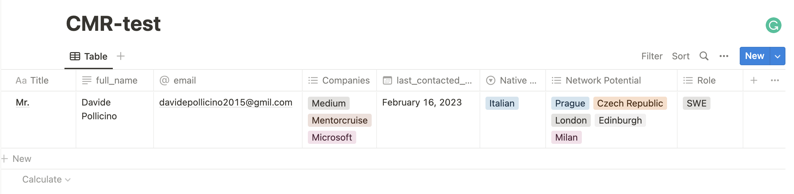
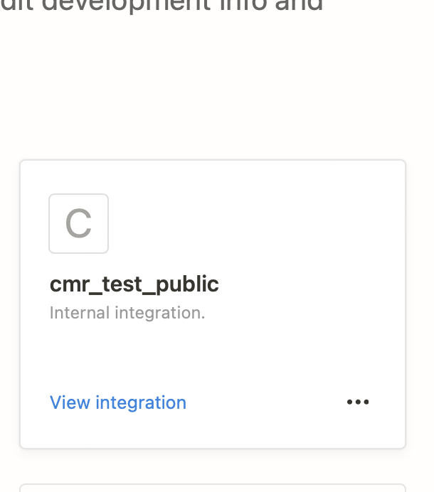
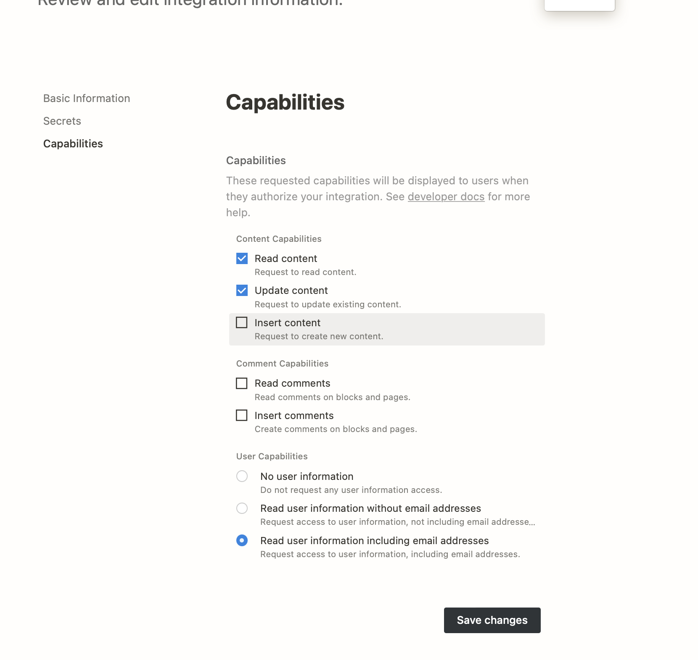
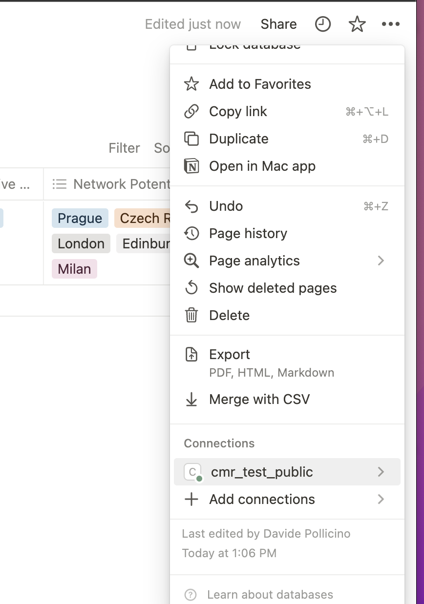

### Background:
* You are a professional and you use a notion database to manage your netwok contacts. This database contains name, email, skills, 
current location, current company and the date you last interacted with this person.

Is not important to have a huge contact list, but have personal relationship with them, and the hardest part is not to build this list, but maintain the relationship active over the time.

Sometimes, I lack in maintaing the relationship active, so, I built a script that automatically contact people and invite them over for a coffee when last iteration was more than 40 days ago.

### Network Notion Manager
Fetch the data from a notion database used to store contacts and/or progressional network details, and
runs daily jobs to send an automatic email with people where last iteration was more than 40 days ago.

### Deployment 
* Serverless solutions => Azure Functions

### Notion Database structure



### System Requirements
* Sendiblue.com account and SMTP configuration (you are able to send up to 100 daily emails for free)
* Dotenv ```pip3 install python-dotenv```
* Pytz ```pip3 install pytz```
* Notion client ```pip3 install notion-client```
* SSL (version >=1.0.1)


### Notion background 

Database ID: You'll find the Database ID in the url. Suppose this is the example url: https://www.notion.so/workspace/XXX?v=YYY&p=ZZZ then XXX is the database ID, YYY is the view ID and ZZZ is the page ID.

To get started, you need:
* A Notion database: login into notion, new, database page
* Configure the database structure as indicated in the picture above, fields name 
and type are sensitive for the automation. ```full_name``` is text, ```last_contacted_date``` is date type.
* Create a notion API KEY: Go to [https://www.notion.so/my-integrations](https://www.notion.so/my-integrations)
* Create a new integration (Fig. 1)
* Copy the integration key in a note (will be added later to your .env)
* Enable the right permission for your integration (Fig. 2)
* Go back to your Notion page => Settings => Link your integration (Fig. 3)


### Install and run 
* Clone repository
* Create virtual environment ```python3 -m venv venv```
* Active your virtual environment ```source venv/bin/activate```
* Install dependencies ```pip3 install -r requirements.txt```
* Create your own .env file, in the same directory:
```
NOTION_API_KEY=<your_notion_api_key>
DATABASE_ID=<database_id>
SMTP_SERVER=<your_smtp_server>
SMTP_PORT=<your_smtp_port>
SMTP_USERNAME=<your_smtp_username>
SMTP_PASSWORD=<your_smtp_password>
SENDER_EMAIL=<sender_email>
```
* Run your program: ```python3 catch-up.py```

### Future Features:
* Add in notion database main tag about the automation language (italian/english), and upon that value, send the email in italian, or, english.
* If todays date is equal to their birthday, send costumized message wishing them happy birthday!

# Fig. 1

# Fig. 2

# Fig. 3

